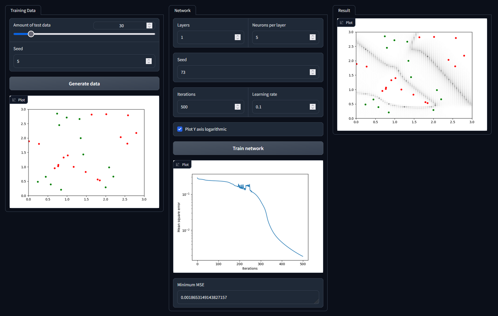

The following guides helped me to understand the mathematics behind neural networks:

1. https://realpython.com/python-ai-neural-network/
2. https://towardsdatascience.com/math-neural-network-from-scratch-in-python-d6da9f29ce65

The first article enabled me to create a neural network with two neurons and made me understand backward propagation.

The second one from [OmarAflak](https://github.com/OmarAflak) helped me to understand how to expand the network to more neurons and layers. I ended up using his code for the network as it was so easy to read and use.

## Demo

You can run the demo using `python main.py`. The ui is made with [Gradio](https://gradio.app/).

This demo shows a neural network trying to separate the "red areas" from the green ones marked by the dots.

On the left side you can generate test data to train the network with.

In the center you can set network parameters and train your network.

On the right side you can see the result.
